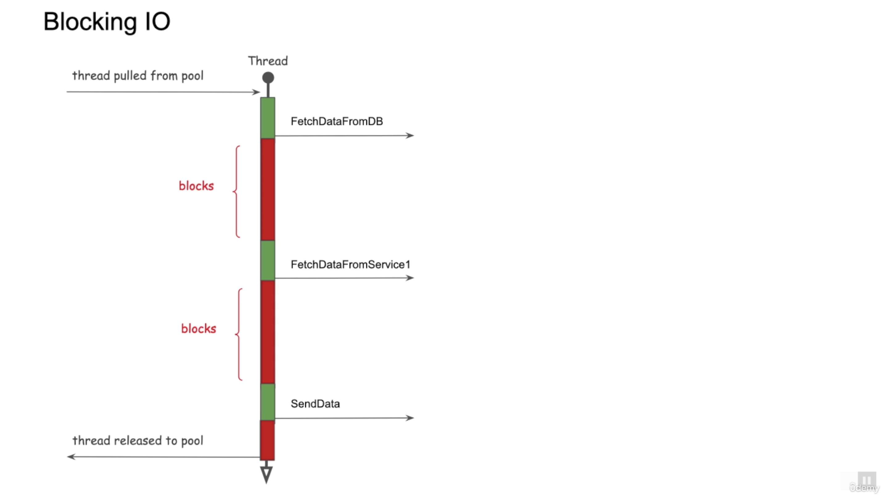
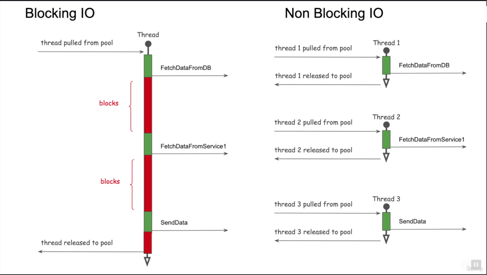

# Java Threads and Scalability
* Task Types
* Concurrency and Parallelism
* Non Blocking IO
* Introduce Ploject Loom


## Task Types
* Talk to a dababase
* Call other services uting http
* Users
* ...

```

data1 = FetchDataFromDB(dbUrl)
data2 = FetchDataFromMicroSevice(url1)
data3 = FetchDataFromMicroSevice(url2)

combinedData = ProcessAndCombine(data1, data2, data3)

//send to the user
SendData(combinedData)

```

* TaskTypes
  * IO Bound
  * CPU Bound

Handling User Requests
* Process Per Request (CGI) Common Gateway Interface  
  * user 1 request -> web Server Proccess 1 <----> User 1 Handler CGI Script Process 
  * user 2 request -> web Server Proccess 2 <----> User 2 Handler CGI Script Process 
  * user 3 request -> web Server Proccess 3 <----> User 3 Handler CGI Script Process 

For every user request a new process in the server is created, this is an issue because a process in an operating system is considered heavyweight  

A variation of CGI was created called fast CGI, this is like having a pool of processes, and the user request is handled by one of the available processes.  
This solves some problems but not all.  

* Process Per User Request (This is just for curiosity - It is an OLD architecture)
  * Process is heavyweight
  * Limited number of process per machine
    * Scalability issues
    * Cannot support large number of users
  * Expensive Proccess startup and termination time
  * Difficult to share data or communicate between Processes
  * FastCGI
    * Pooling of Processes
    * CGI processes are start upfront for performance


  
### Thread Per User Request
* Thread is lightweight
  * But has it own stack
* Can handle large number of concurrent users
* Can share data or communicate between threads
* Improved Performance
  * No extra process to deal with
* Easy to understand
* Easy to debug
* The application servers (tomcat, weblogic, etc...) uses a pool of threads for user requests  


### Concurrency Versus Parallelism

#### Concurrency
* Multiple indepdendent tasks are making progress but many not execute at the **same** time
* Appearance of Parallelism
* CPU time slicing

#### Parallelism
* Multiple dependent sub tasks are executing at the **same** time
* Multiple cores needed
* No parallelism in single core

#### Synchronous Call
* Sequential execution of code
* Easy to undestand
* Easy to debug

#### Asynchronous Call
* Does not wait for call to complete
* Callbacks, futures
* More complex to understand
* In Java, user Threads


### Java Threads
* Thread Stack
* Shared Heap
* Fundamental to the Java Platform
  * Debuging
  * Exceptions
* Every Java Thread is a wrapper around an OS Thread
  * OS Thread is an expensive resource
* Thread Pools
* Stack Memory Size can be set (-Xss)
* Head memory can be set
  * -Xmx, -Xms
* java -Xss512k -Xmx1G -Xms256k com.droveda.test.CommandLineProcessor <command> <arg1> <arg2>


### Threads and Scalability
* Default stack size 1M
  * as number is users increase, memory usage increases
* There is a max limit to the max threads
  * Depends on VM or Machine Memory
  * Much more socket connections can be supported
  * This prevents optimum scalability
* IO bound tasks
  * Paralyzes the OS thread for a longer time than necessary

## Scalability Solutions

{Optimized Scalable Application} + {Vertical Scaling} + {Horizontal Scaling}  

### Vertical Scaling
* Increase Resources
* CPU, Memory, Disk Space, etc...
* Limit to scaling
* Increases cost
* Cloud Environment

### Horizontal Scaling
* No Limit
* Costly

### Non Blocking IO



  


```
pseudo code for Non Blocking IO (Callbacks)

//Non blocking : fetch some data from DB
FetchDataFromDB(dbUrl, DBCallback(data1)) {

  //Non blocking : Fetch some data from Microservice 1
  FetchDataFromService1(url1, RestCallback(data2)) {

      //Process all data and send
      combinedData = ProcessAndCombine(data1, data2)
      SendData(combinedData)

  }

}

//Control reaches here before data is returned
//Thread is released
```

## Non Blocking IO in Java
* Non Blocking IO
  * Java NIO (New IO) {July 2011 with JDK 7}
    * Non blocking File and Socket Handling
  * Java CompletableFutures {March 2014 with JDK 8}
  * Servlet 3.0 and 3.1 includes Non Blocking Servlet
* Reactive Programming
  * RxJava, Project Reactor
  * Spring WebFlux (Spring V5)
* Disadvantages
  * High Complexity for Developers
  * Easy to make mistakes
  * End to End Non Blocking


**Java Virtual Threads** is an alternative solution.  