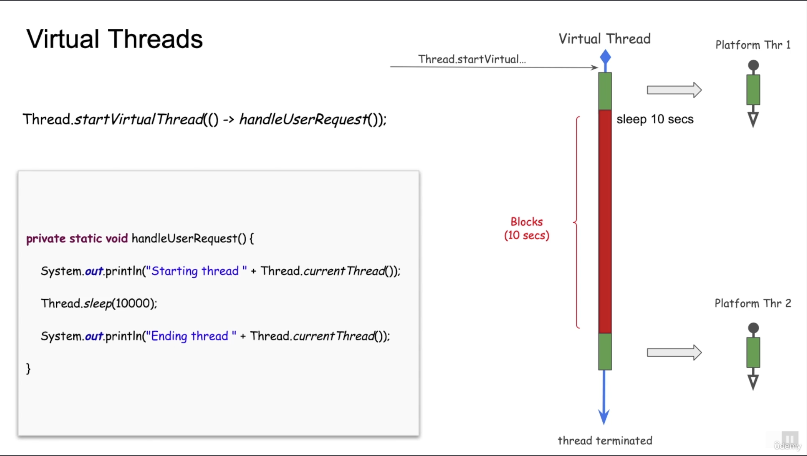
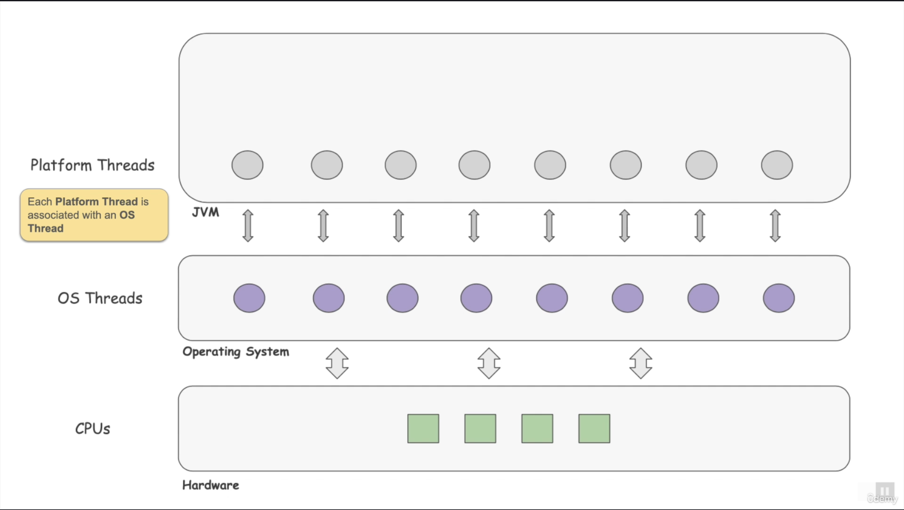
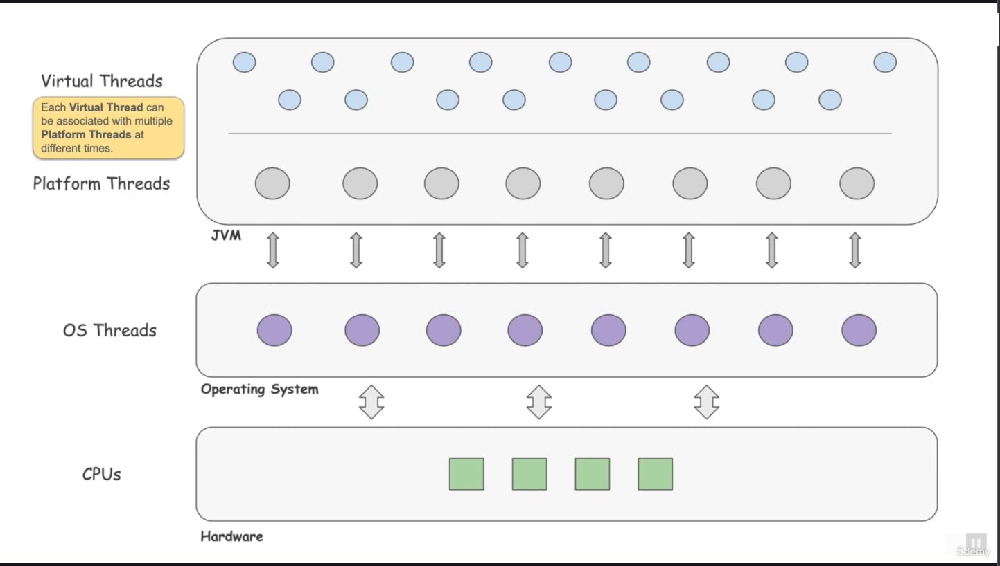
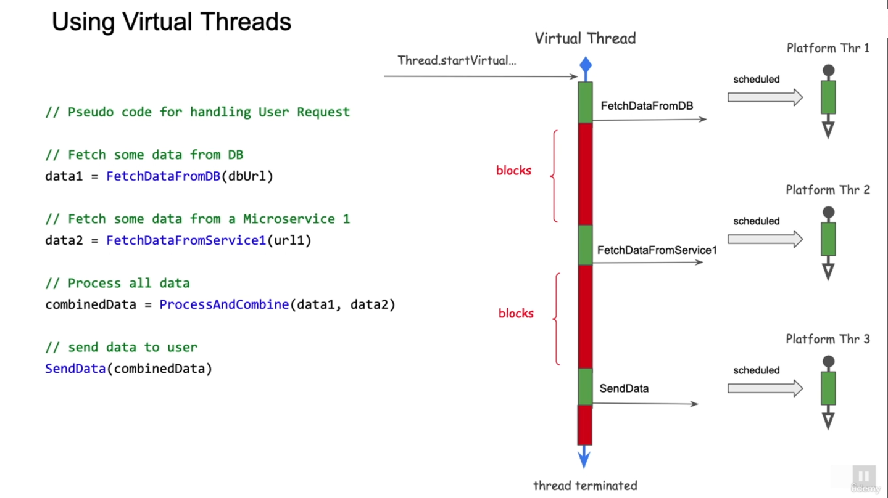

# Virtual Threads

* Platform Threads
  * new Thread(() -> handleUserRequest()).start();
* Virtual Threads
  * Thread.startVirtualThread(() -> handleUserRequest());


  

  

  


## Creating Virtual Threads

```
//option 1
//start a new virtual thread. No name is associated with thread
Thread t = Thread.startVirtualThread(() -> handleUserRequest());

//make sure the thread terminates
t.join();

//control reaches here once the virtual threads complete
```

```
//option 2
//create a virtual builder object with name and initial index
OfVirtual vBuilder = Thread.ofVirtual().name("userthread", 0);

//start two virtual threads using the builder
Thread vThread1 = vBulder.start(() -> handleUserRequest());
Thread vThread2 = vBulder.start(() -> handleUserRequest());

//make sure the thread terminates
vThread1.join();
vThread2.join();

//control reaches here once the virtual threads complete
```

```
//option 3
//create a thread factory
ThreadFactory factory = Thread.ofVirtual().name("userthread", 0).factory();

//start two virtual threads using the builder
Thread vThread1 = factory.newThread(() -> handleUserRequest());
vThread1.start();

Thread vThread2 = factory.newThread(() -> handleUserRequest());
vThread2.start();

//make sure the thread terminates
vThread1.join();
vThread2.join();

//control reaches here once the virtual threads complete
```

```
//option 4 - Using the virtual Thread Executor Service

//create an virtual thread executor service
//note the try with resource which make sure all Virtual threads are terminated

try (ExecutorService srv = Executors.newVirtualThreadPerTaskExecutor()) {

    //submit two tasks to the executor service
    srv.submit(VirtualMethodsPlay::handleUserRequest);
    srv.submit(VirtualMethodsPlay::handleUserRequest);

}

//control reaches here once the two virtual threads complete
```


```
//option 4 (with Factory) - Using the virtual Thread Executor Service with custom name

ThreadFactory factory = Thread.ofVirtual().name("uuserThread", 0).factory();

//create an virtual thread executor service
//note the try with resource which make sure all Virtual threads are terminated

try (ExecutorService srv = Executors.newThreadPerTaskExecutor(factory)) {

    //submit two tasks to the executor service
    srv.submit(VirtualMethodsPlay::handleUserRequest);
    srv.submit(VirtualMethodsPlay::handleUserRequest);

}

//control reaches here once the two virtual threads complete
```


### Virtual Threads Advantages

* Light weight Thread (extends the Thread class)
  * Fast Creation time
  * Exhibits same baheviour as Platform Threads
  * Scales to millions of instances
* Advantages
  * No need for thread pool
  * Can block on IO with no scalability issues
  * Optimal Concurrency
  * Code can still be **Sequential**
  * Existing code will benefit from using Virtual Thread
  * Combine with Futures and CompletableFuture

  


### Java Virtual Threads Current Limitations
* Don't use a Monitor (synchronized)
  * Use Locks from java.util.concurrent


```
Virtual Threads : A few Good Links

Here are a few links that would be useful to get more insight into Virtual Threads.


Virtual threads: scalable, harmonious concurrency
https://www.youtube.com/watch?v=3BzKf7XvqKM

A talk from Ron Pressler, Project Lead of Project Loom at Java Pathfinder Workshop 2022


JEP 444: Virtual Threads
https://openjdk.org/jeps/444
This JEP (Java Enhancement Proposal) talks about the goals, non goals, motivations and a complete description of Virtual Threads.


Project Loom Wiki
https://wiki.openjdk.org/display/loom/Main 

Project Loom Download Site
https://jdk.java.net/loom/

The Wiki site contains a lot of links to past talks about Project Loom and it also talks about other related initiatives like Structured Concurrency and Continuations (which we will learn about later in the course). The Download site points to the latest early access JDK build that supports Project Loom. 
```


httpbin.org  
httpbin.org/delay/4