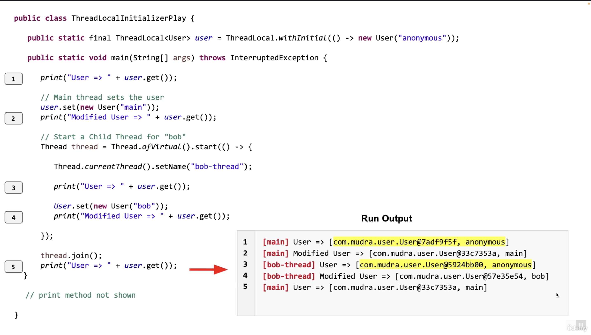
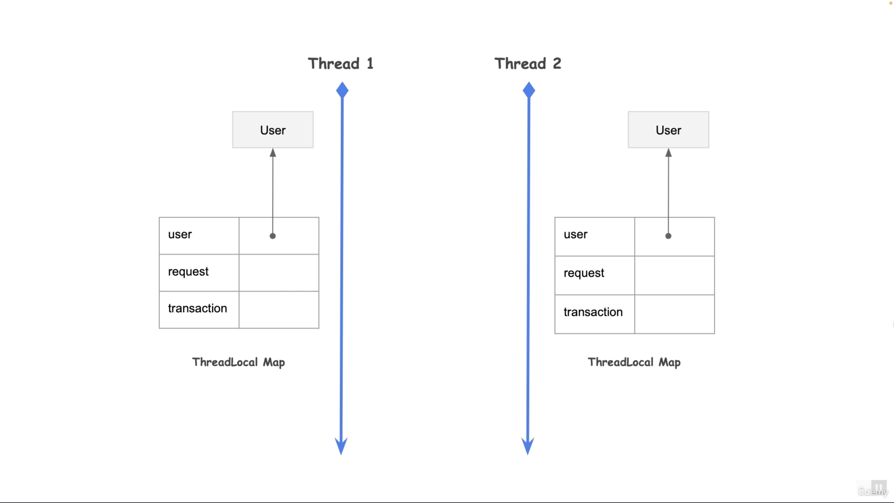
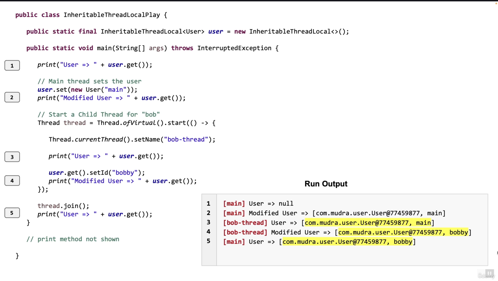
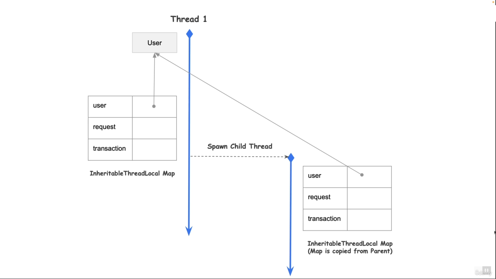
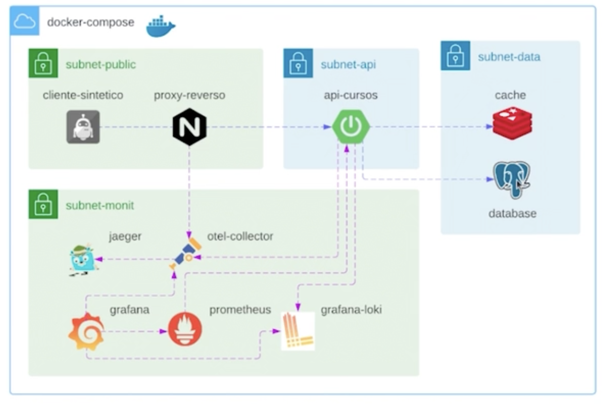
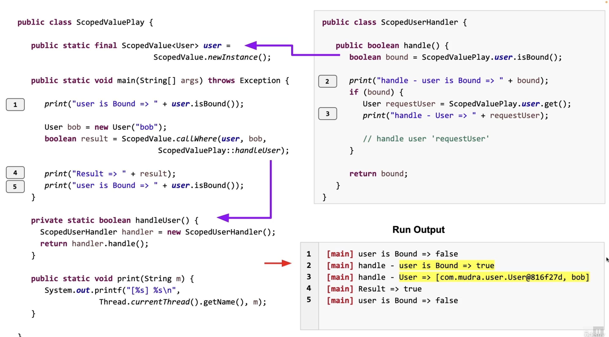
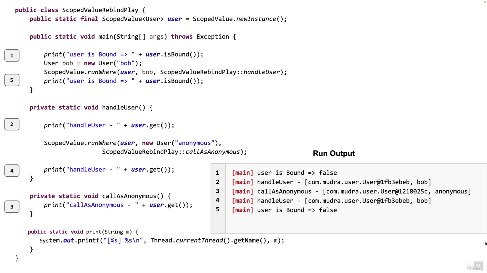

# Thread Locals and Scoped Values

## Recap
* Java Threads and Scalability Issues
* Virtual Threads
* Virtual Threads, Futures, Completable Futures
* Structured Concurrency
* Thread Local
* Scoped value


## Java Scopes

### ThreadLocal
```
// declare a Thread Local Variable user
public static final ThreadLocal<User> user = new ThreadLocal<>();

//sets the current thread's value for user
user.set(new User("bob));

//gets the current thread's value for user
User requestUser = user.get();

//removes the current thread's value for user
user.remove();
```

```
//declare a Thread Local Variable user with an Initializer
public static ThreadLocal<User> user = ThreadLocal.withInitial(() -> new User("anonymous"));

//Returns Anonymous but new user object per thread (Thread safe)
User requestUser = user.get();
```

  

  


## Inheritable Thread Local
The child thread will have visibility to the parent Thread Local.  
* Copied From Parent to Child Thread
  * By default, child value is identical to Parent value **Thread-safety**
  * Child Value as function of Parent Value

```
//declare a Inherited Thread Local Variable user
public static final InheritableThreadLocal<User> user = new InheritableThreadLocal<>();

user.set(new User("bob"));

User requestUser = user.get();

user.remove();
```

  

  

## Disadvantages of Thread Locals
* Unconstrained Mutability
  * Leads to Spaghetti-like
  * Data Flow
* Unbounded Lifetime
  * remove() has to be called
  * beware of memory leaks
* Expensive Inheritance
  * Map needs to be copied to Child
  * Possible Memory issues for large number of Virtual Threads


# Scoped Values
* Can be accessed from within "dynamic" scope of a method
* Immutable


```
//creates a scoped value that is initially unbound for all threads
public static final ScopedValue<User> user = ScopedValue.newInstance();

//binds the 'user' to bib within the scope of Callable method 'handleuser'
User bob = new User("bob");
boolean result = ScopedValue.callWhere(user, bob, ScopedValuePlay::handleuser);

//signature
public static <T, R> R callWhere(ScopedValue<T>, T value, Callable<? extends R> op)
```

```
//returns the value of the scoped value if bound in the current thread, otherwise Exception
User requestUser = user.get();

//return tue if the scoped value is bound in the current thread
boolean bound = user.isBound();
```

  

```
//binds the 'user' to bob within the scope of Runnable method 'handleUser'
ScopedValue.runWhere(user, bob, ScopedValuePlay::medhodWithNoReturn);
```

```
//binds the 'user' to bob within the scope of Supplier method 'handleUser'
User bob = new User("bob");
boolean result = ScopedValue.getWhere(user, bob, ScopedValuePlay::handleUser);
```

```
//declare two scoped values
public static final ScopedValue<User> user = ScopedValue.newInstance();
public static final ScopedValue<UsRequester> request = ScopedValue.newInstance();

//binds the userto bob, request to HttpRequest within the scope of Callable method 'handleUser'
boolean result = ScopedValue.where(user, bob)
                            .where(request, httpRequest)
                            .call(ScopedValuePlay::handleUser);
```

  

  


Note that the ScopedValue JDK class used in these lectures is in Preview mode for JDK 21. There might be slight changes in the API of this class when it finally goes out of Preview  