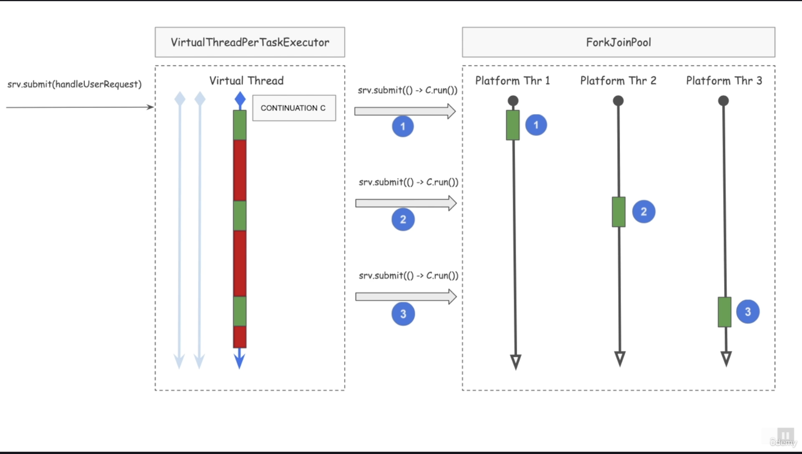

# Coroutines and Continuations

In JDK 21, the Continuation classes are hidden in the package  jdk.internal.vm and needs to be explicitly exposed. We will be exposing the Continuation JDK classes just to get a feel for Continuation as a concept. Do not plan to use these classes in Production systems.  

Follow the instructions below to run the Continuation Example.  

    Refer to Lecture "Instructions to install an eclipse project ZIP" to install the project zip : continuation-play.zip  

    Importing the project will make sure that the Continuation classes are automatically exposed. As a part of the eclipse project, this setting is in file .settings/org.eclipse.jdt.core.prefs file  

    You can run the class ContinuationPlay to experiment  

Java Virtual Threads Implementation using Continuations  
  